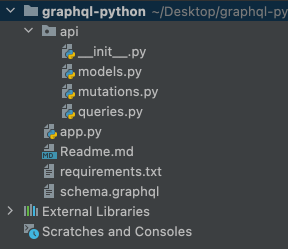

## Using GraphQL with Python (Flask)

To get up and running with GraphQL API using Python, Flask, and Ariadne.

## Learning objectives
1. Set up a Python web server with Flask
2. Use the Ariadne library to implement GraphQL
3. Compose a GraphQL Schema 
4. Perform queries and mutations against a Python GraphQL API

## Creating a new python virtual environment

In Python, best practices are to use a virtual environment. We can create a new virtual environment by running the following command.

    python3 -m venv myapp

Next, we have to activate the virtual environment. If you are on a Linux or Mac machine you can run the source command with the path of the activate script like shown below.
    
    source myapp/bin/activate

And if you’re on a windows machine, you can run the following command to activate the virtual environment.

    myapp/bin/activate.bat

## Installing dependencies
Our application relies on the following dependencies:

1. Flask — this is the web server that we’ll use
2. Flask-SQLAlchemy — an ORM that makes it easier for us to communicate with our SQL database
3. Ariadne — a library for GraphQL python integration
4. Flask-Cors — an extension for Cross Origin Resource Sharing

You can install them all using a single command:

       pip install -r requirements.txt

## Project Structure

## Make a .env file in current directory
Please refer .env.example

## Run the flask application

    python app.py

